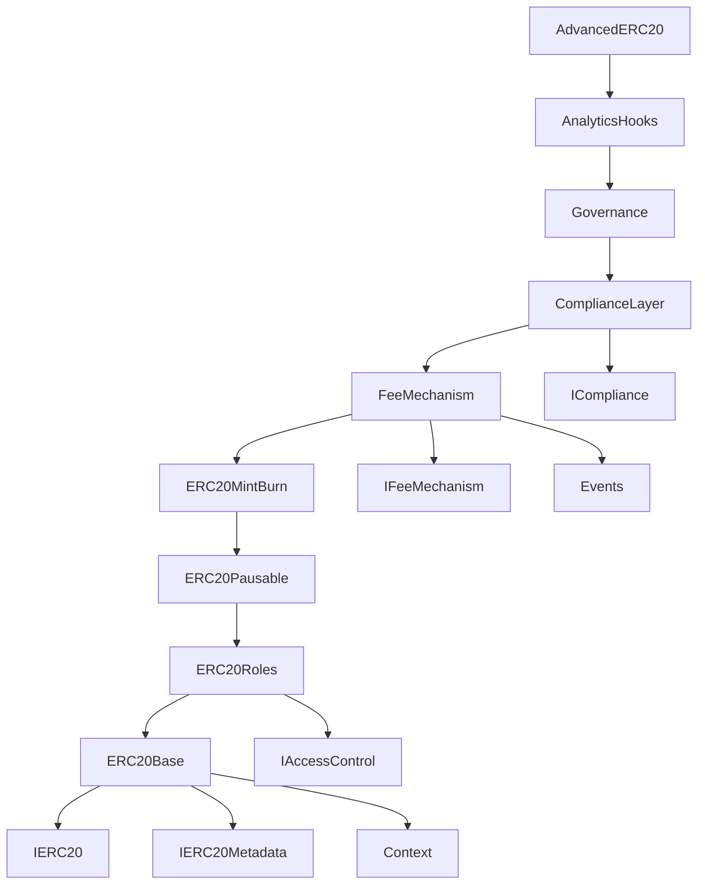

# Module Relationships

## Inheritance Hierarchy

The Advanced ERC-20 token system uses a layered inheritance approach where each module builds upon the previous ones, creating a comprehensive token with advanced features.

```
ERC20Base (Foundation)
    │
    ├── Context (Utility)
    │
    └── ERC20Roles (Access Control)
            │
            └── ERC20Pausable (Emergency Control)
                    │
                    └── ERC20MintBurn (Supply Management)
                            │
                            └── FeeMechanism (Economic Layer)
                                    │
                                    └── ComplianceLayer (Regulatory)
                                            │
                                            └── Governance (Decision Making)
                                                    │
                                                    └── AnalyticsHooks (Monitoring)
                                                            │
                                                            └── AdvancedERC20 (Final Implementation)
```

## Module Dependencies

### Core Dependencies


## Functional Relationships

### 1. ERC20Base (Foundation Layer)
**Purpose**: Provides core ERC-20 functionality
**Dependencies**: 
- `Context` for `_msgSender()` and `_msgData()`
- `IERC20` and `IERC20Metadata` interfaces

**Key Functions**:
```solidity
function transfer(address to, uint256 amount) public virtual returns (bool)
function approve(address spender, uint256 amount) public virtual returns (bool)
function transferFrom(address from, address to, uint256 amount) public virtual returns (bool)
```

**Relationships**:
- **Used by**: All higher-level modules
- **Overridden by**: `FeeMechanism`, `ComplianceLayer`, `ERC20Pausable`

### 2. ERC20Roles (Access Control Layer)
**Purpose**: Implements role-based access control
**Dependencies**: 
- `ERC20Base` for core functionality
- `IAccessControl` interface

**Key Roles**:
```solidity
bytes32 public constant DEFAULT_ADMIN_ROLE = 0x00;
bytes32 public constant MINTER_ROLE = keccak256("MINTER_ROLE");
bytes32 public constant BURNER_ROLE = keccak256("BURNER_ROLE");
bytes32 public constant PAUSER_ROLE = keccak256("PAUSER_ROLE");
bytes32 public constant COMPLIANCE_ROLE = keccak256("COMPLIANCE_ROLE");
bytes32 public constant GOVERNOR_ROLE = keccak256("GOVERNOR_ROLE");
bytes32 public constant ANALYTICS_ROLE = keccak256("ANALYTICS_ROLE");
```

**Relationships**:
- **Extends**: `ERC20Base`
- **Used by**: All modules requiring access control
- **Provides**: Role management for all system operations

### 3. ERC20Pausable (Emergency Control Layer)
**Purpose**: Adds emergency pause functionality
**Dependencies**: 
- `ERC20Roles` for access control

**Key Functions**:
```solidity
function pause() public onlyRole(PAUSER_ROLE)
function unpause() public onlyRole(PAUSER_ROLE)
modifier whenNotPaused()
```

**Relationships**:
- **Extends**: `ERC20Roles`
- **Overrides**: `_transfer`, `_mint`, `_burn` to add pause checks
- **Used by**: Emergency response procedures

### 4. ERC20MintBurn (Supply Management Layer)
**Purpose**: Controlled token minting and burning
**Dependencies**: 
- `ERC20Pausable` for pause-aware operations

**Key Functions**:
```solidity
function mint(address to, uint256 amount) public onlyRole(MINTER_ROLE)
function burn(uint256 amount) public
function burnFrom(address account, uint256 amount) public onlyRole(BURNER_ROLE)
```

**Relationships**:
- **Extends**: `ERC20Pausable`
- **Enforces**: Maximum supply limits
- **Integrates**: With pause mechanism for security

### 5. FeeMechanism (Economic Layer)
**Purpose**: Implements transfer fees with burn and treasury distribution
**Dependencies**: 
- `ERC20MintBurn` for supply management
- `IFeeMechanism` interface
- `Events` library for logging

**Key Functions**:
```solidity
function setTransferFee(uint256 newFee) external onlyRole(DEFAULT_ADMIN_ROLE)
function setTreasury(address newTreasury) external onlyRole(DEFAULT_ADMIN_ROLE)
function setBurnRate(uint256 newRate) external onlyRole(DEFAULT_ADMIN_ROLE)
```

**Relationships**:
- **Extends**: `ERC20MintBurn`
- **Overrides**: `_transfer` to implement fee logic
- **Coordinates**: With burn mechanism for deflationary pressure

### 6. ComplianceLayer (Regulatory Layer)
**Purpose**: Implements compliance features (blacklisting, limits)
**Dependencies**: 
- `FeeMechanism` for economic operations
- `ICompliance` interface

**Key Functions**:
```solidity
function blacklistAddress(address account) external onlyRole(COMPLIANCE_ROLE)
function whitelistAddress(address account) external onlyRole(COMPLIANCE_ROLE)
function setTransferLimit(uint256 newLimit) external onlyRole(COMPLIANCE_ROLE)
```

**Relationships**:
- **Extends**: `FeeMechanism`
- **Overrides**: `_transfer` and `_mint` to add compliance checks
- **Enforces**: Regulatory requirements before economic operations

### 7. Governance (Decision Making Layer)
**Purpose**: On-chain governance with proposals and voting
**Dependencies**: 
- `ComplianceLayer` for compliant operations

**Key Functions**:
```solidity
function createProposal(string memory description) external returns (uint256)
function vote(uint256 proposalId, bool support) external
function executeProposal(uint256 proposalId) external onlyRole(GOVERNOR_ROLE)
```

**Relationships**:
- **Extends**: `ComplianceLayer`
- **Uses**: Token balances for voting weight
- **Manages**: System parameter changes through proposals

### 8. AnalyticsHooks (Monitoring Layer)
**Purpose**: Event-based tracking and analytics
**Dependencies**: 
- `Governance` for complete system access
- `Events` library for structured logging

**Key Functions**:
```solidity
function getMetrics() external view returns (uint256, uint256, uint256)
function getCategoryVolume(bytes32 category) external view returns (uint256)
function resetMetrics() external onlyRole(ANALYTICS_ROLE)
```

**Relationships**:
- **Extends**: `Governance`
- **Overrides**: `_transfer`, `_mint`, `_burn` to add analytics
- **Provides**: Real-time metrics and historical data

## Cross-Module Interactions

### Fee and Compliance Coordination
```solidity
// In ComplianceLayer._transfer()
function _transfer(address from, address to, uint256 amount) internal virtual override {
    // 1. Compliance checks first
    require(!_blacklisted[from], "ComplianceLayer: sender is blacklisted");
    require(!_blacklisted[to], "ComplianceLayer: recipient is blacklisted");
    require(_transferLimit == 0 || amount <= _transferLimit, "ComplianceLayer: transfer amount exceeds limit");
    
    // 2. Call parent (FeeMechanism) which handles fees
    super._transfer(from, to, amount);
}
```

### Role-Based Operation Flow
```solidity
// Example: Minting with full system integration
function mint(address to, uint256 amount) public onlyRole(MINTER_ROLE) {
    // 1. Role check (ERC20Roles)
    // 2. Pause check (ERC20Pausable) 
    // 3. Supply limit check (ERC20MintBurn)
    // 4. Compliance check (ComplianceLayer)
    // 5. Analytics recording (AnalyticsHooks)
    // 6. Core mint operation (ERC20Base)
}
```

### Emergency Response Coordination
```solidity
// Emergency pause affects all operations
modifier whenNotPaused() {
    _requireNotPaused();
    _;
}

// Applied to:
// - All transfers (including fee transfers)
// - Minting operations
// - Burning operations
// - But NOT governance voting or role management
```

## Interface Relationships

### External Interfaces
```solidity
interface IERC20 {
    // Standard ERC-20 functions
}

interface IERC20Metadata is IERC20 {
    // Metadata extensions
}

interface IAccessControl {
    // Role management functions
}

interface IFeeMechanism {
    // Fee configuration functions
}

interface ICompliance {
    // Compliance management functions
}
```

### Internal Interfaces
```solidity
// Events library provides structured event definitions
library Events {
    event FeeCollected(address indexed from, address indexed to, uint256 amount, uint256 fee);
    event TokensBurned(address indexed account, uint256 amount, string reason);
    event ComplianceViolation(address indexed account, string reason);
    // ... more events
}
```

## Data Flow Between Modules

### Transfer Operation Data Flow
```
User calls transfer()
        │
        ▼
ComplianceLayer
├── Check blacklist status
├── Validate transfer limits
└── Call super._transfer()
        │
        ▼
FeeMechanism
├── Calculate fees
├── Split fees (burn/treasury)
├── Execute fee transfers
└── Call super._transfer()
        │
        ▼
ERC20Pausable
├── Check pause state
└── Call super._transfer()
        │
        ▼
ERC20Base
├── Update balances
├── Emit Transfer events
└── Update allowances
        │
        ▼
AnalyticsHooks
├── Record metrics
├── Emit analytics events
└── Update user activity
```

### Configuration Change Data Flow
```
Admin calls setTransferFee()
        │
        ▼
Role Check (ERC20Roles)
├── Verify DEFAULT_ADMIN_ROLE
└── Proceed if authorized
        │
        ▼
FeeMechanism
├── Validate fee range
├── Update fee storage
└── Emit FeeUpdated event
        │
        ▼
AnalyticsHooks
├── Record configuration change
└── Update system metrics
```

## Module Isolation and Coupling

### Loose Coupling Principles
1. **Interface Segregation**: Each module exposes only necessary functions
2. **Dependency Inversion**: Higher-level modules depend on abstractions
3. **Single Responsibility**: Each module has one primary concern
4. **Open/Closed**: Modules are open for extension, closed for modification

### Tight Coupling Areas (By Design)
1. **Inheritance Chain**: Necessary for function overriding
2. **Role Dependencies**: Security requires centralized role management
3. **Event Coordination**: Analytics requires access to all operations

### Extension Points
```solidity
// New modules can extend AnalyticsHooks
contract CustomModule is AnalyticsHooks {
    // Add new functionality while maintaining all existing features
    function customFunction() external {
        // Custom logic here
    }
    
    // Override existing functions to add custom behavior
    function _transfer(address from, address to, uint256 amount) internal virtual override {
        // Custom pre-processing
        super._transfer(from, to, amount);
        // Custom post-processing
    }
}
```

This modular architecture ensures that each component has clear responsibilities while maintaining the ability to work together seamlessly for complex operations.